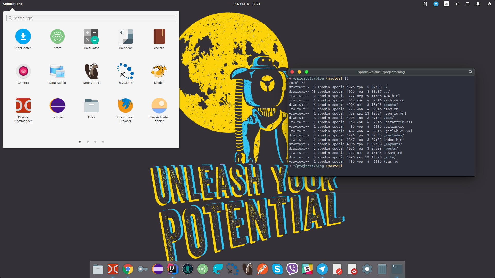

# Elementary Config

**Elementary Config** is a set of resources and instructions I follow to set up a new development and working environment on  [elementary OS](https://elementary.io) powered machine.


## Download and Unpack

```bash
cd /tmp && \
curl -LOk https://github.com/spodin/elementary-config/archive/master.zip && \
unzip master.zip && \
rm master.zip
```

## Checklist

1. [OS](#1-prep-elementary-os)
2. [IntelliJ IDEA](#2-prep-intellij-idea)
3. [Google Chrome](#3-prep-google-chrome)

---

### 1. Prep elementary OS

- `./install.sh`
- `./appearance.sh`
- `./terminal/ocean-theme.sh`

### 2. Prep IntelliJ IDEA

- [Download](https://www.jetbrains.com/idea/download/#section=linux) Linux-related distribution (.tar.gz)
- File ⯈ Import Settings... from `apps/idea-settings.jar`

### 3. Prep Google Chrome

- Install extensions:
  - [AdBlock](https://chrome.google.com/webstore/detail/adblock/gighmmpiobklfepjocnamgkkbiglidom?utm_source=chrome-app-launcher-info-dialog)
  - [AdBlock Plus](https://chrome.google.com/webstore/detail/adblock-plus/cfhdojbkjhnklbpkdaibdccddilifddb?utm_source=chrome-app-launcher-info-dialog)
  - [Checker Plus for Gmail™](https://chrome.google.com/webstore/detail/checker-plus-for-gmail/oeopbcgkkoapgobdbedcemjljbihmemj?utm_source=chrome-app-launcher-info-dialog)
  - [Evernote Web Clipper](https://chrome.google.com/webstore/detail/evernote-web-clipper/pioclpoplcdbaefihamjohnefbikjilc?utm_source=chrome-app-launcher-info-dialog)
  - [OneTab](https://chrome.google.com/webstore/detail/onetab/chphlpgkkbolifaimnlloiipkdnihall?utm_source=chrome-app-launcher-info-dialog)
  - [Save to Pocket](https://chrome.google.com/webstore/detail/save-to-pocket/niloccemoadcdkdjlinkgdfekeahmflj?utm_source=chrome-app-launcher-info-dialog)
  - [TLDRify](https://chrome.google.com/webstore/detail/tldrify/dbphpdgmhigmaepjklmklmlcoinihjdo?utm_source=chrome-app-launcher-info-dialog)
  - [Lingvo Translator+](https://chrome.google.com/webstore/detail/lingvo-translator%20/gjceecgpmolmpdeidmfehcfepdfmmffl?utm_source=chrome-app-launcher-info-dialog)
  - [Papier](https://chrome.google.com/webstore/detail/papier/hhjeaokafplhjoogdemakihhdhffacia) or [Momentum](https://chrome.google.com/webstore/detail/momentum/laookkfknpbbblfpciffpaejjkokdgca?utm_source=chrome-app-launcher-info-dialog)
  - [SmoothScroll](https://chrome.google.com/webstore/detail/smoothscroll/nbokbjkabcmbfdlbddjidfmibcpneigj?utm_source=chrome-app-launcher-info-dialog)
  - [PostMan](https://chrome.google.com/webstore/detail/postman/fhbjgbiflinjbdggehcddcbncdddomop?utm_source=chrome-app-launcher-info-dialog)
  - [Octotree](https://chrome.google.com/webstore/detail/octotree/bkhaagjahfmjljalopjnoealnfndnagc?utm_source=chrome-app-launcher-info-dialog)

## Final View Screenshot



## Thanks To

- [yarik-vv](https://github.com/yarik-vv) / [OS-X-buttons](https://github.com/yarik-vv/OS-X-buttons)
